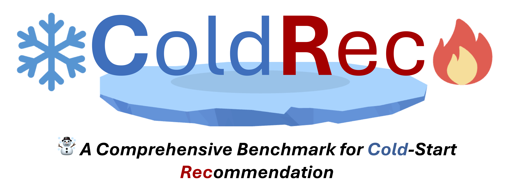

<div align="center">

</div>

------

<div align="center">
    <a href="https://github.com/YuanchenBei/ColdRec"></a>
    <a href="https://github.com/YuanchenBei/ColdRec/blob/main/LICENSE"></a>
</div>


# ❄️ ColdRec 🔥
☃️ **ColdRec** is a comprehensive open-source toolkit and benchmark for cold-start recommendation. In coldrec, models follow a ***unified pipeline***, the datasets follow a ***unified division***, and tasks include ***cold user/item recommendation***, ***warm user/item recommendation***, and ***overall user/item recommendation***, targeting at providing the community with a ***comprehensive*** and ***fair*** benchmark evaluation for cold-start recommendation.


- [❄️ ColdRec 🔥](#️-coldrec-)
  - [🛫 Requirements](#-requirements)
  - [🚀 Quick Start](#-quick-start)
  - [🧸 Supported Models](#-supported-models)

🥳 **Update in 2024.06.30**: Add automatic hyper-parameter tuning, you can install one more base library *optuna* to include this module.

---
## 🛫 Requirements
ColdRec hopes to avoid the complicated and tedious packaging process and uses native ***pytorch*** and a small number of necessary libraries to build the codebase.

``` bash
python >= 3.8.0 
torch >= 1.11.0
faiss-gpu >= 1.7.3
pandas >= 2.0.3
numba >= 0.58.1 
numpy >= 1.24.4
scikit-learn >= 1.3.2
pickle >= 0.7.5
optuna >= 3.6.1 (If you need automatic hyper-parameter tuning) 
```

---
## 🚀 Quick Start
**1️⃣ Dataset Preprocess**

We have provided the preprocessed datasets in [Google Drive](https://drive.google.com/drive/folders/13JJ25vf5dpFzxe1ITQYONrEIUAsB2ZU8?usp=sharing). You can download the dataset from the Google Drive link directly, unzip it, and place it into the ***./data*** folder. Then, you can process it into the format for model training with ***simple two scripts***, of which the details can be found in the page of [dataset details](https://github.com/YuanchenBei/ColdRec/blob/main/data/README.md).

**2️⃣ Warm Embedding Pre-Training**

This step is *not necessary*, but since most of the work requires this step, it is *recommended* to complete this step to fully evaluate all models. We have provided both widely adopted collaborative filtering modle MF and graph-based model LightGCN as warm recommender. You can obtain the pre-trained warm user/item embeddings with the following two options:

***Options 1:*** You can directly access the BPR-MF pre-trained embeddings at the [Google Drive](https://drive.google.com/drive/folders/1cHTWgNGTlWJwO2ziS4crxkpuH38rTeCf?usp=sharing). Then, the embedding folder associated to each dataset should be placed in the ***./emb*** folder.

***Options 2:*** You can also pre-train the warm embedding by yourself. Specifically, you can simply obtain the pre-trained warm embeddings by running the following script:
``` bash
python main.py --dataset [DATASET NAME] --model [WARM RECOMMENDER] --cold_object [user/item]
```
In the above script, the **[DATASET NAME]** for --dataset should be replaced by your target dataset name, such as movielens. Then, the **[WARM RECOMMENDER]** for --model should be selected as the warm recommender type (MF, LightGCN, NCL, SimGCL, and XSimGCL). Finally, the **[user/item]** for --cold_object should be selected as user or item for the user cold-start setting or item cold-start setting.

**3️⃣ Cold-Start Model Training and Evaluation**

Coming to this step, you can start to train the cold-start model with one script:
``` bash
python main.py --dataset [DATASET NAME] --model [MODEL NAME] --cold_object [user/item]
```
In the above script, the **[MODEL NAME]** for --model is the expected model name, where we have provided 20 representative models as the **Supported Models**. You can also flexibly register your own model with the ColdRec framework for evaluation.

**4️⃣ (Option) Automatic Hyper-parameter Tuning**

ColdRec also supports automatic hyper-parameter tuning. You can tune hyper-parameters with optuna with one script:
``` bash
python param_search.py --dataset [DATASET NAME] --model [MODEL NAME] --cold_object [user/item]
```
You can flexibly set the tuning range in param_search.py.

---

## 🧸 Supported Models
| **ID** | **Paper** | **Model** | **Venue** |
|--------|---------|:----------:|:--------------:|
| 1      | [BPR: Bayesian Personalized Ranking from Implicit Feedback](https://arxiv.org/pdf/1205.2618) | BPR-MF | UAI 2009 |
| 2      | [Deep Content-based Music Recommendation](https://proceedings.neurips.cc/paper/2013/file/b3ba8f1bee1238a2f37603d90b58898d-Paper.pdf)     |    DeepMusic    |   NeurIPS 2013    |
| 3     | [Social Collaborative Filtering for Cold-start Recommendations](https://dl.acm.org/doi/10.1145/2645710.2645772)     |    KNN    |   RecSys 2014    |
| 4      | [Learning Image and User Features for Recommendation in Social Networks](https://openaccess.thecvf.com/content_iccv_2015/papers/Geng_Learning_Image_and_ICCV_2015_paper.pdf) |    DUIF     |   ICCV 2015    |
| 5      | [VBPR: Visual Bayesian Personalized Ranking from Implicit Feedback](https://ojs.aaai.org/index.php/AAAI/article/view/9973)  |   VBPR   |    AAAI 2016    |
| 6     | [DropoutNet: Addressing Cold Start in Recommender Systems](https://papers.nips.cc/paper_files/paper/2017/file/dbd22ba3bd0df8f385bdac3e9f8be207-Paper.pdf)  |   DropoutNet   | NeurIPS 2017 |
| 7      | [Adversarial Training Towards Robust Multimedia Recommender System](https://arxiv.org/pdf/1809.07062)  |    AMR    |  TKDE 2019  |
| 8     | [Warm Up Cold-start Advertisements: Improving CTR Predictions via Learning to Learn ID Embeddings](https://dl.acm.org/doi/10.1145/3331184.3331268)  |    MetaEmbedding    | SIGIR 2019 |
|  9     | [LightGCN: Simplifying and Powering Graph Convolution Network for Recommendation](https://arxiv.org/pdf/2002.02126) | LightGCN | SIGIR 2020 |
| 10     | [How to Learn Item Representation for Cold-Start Multimedia Recommendation?](https://dl.acm.org/doi/10.1145/3394171.3413628)  |    MTPR    | MM 2020 |
| 11     | [LARA: Attribute-to-feature Adversarial Learning for New-item Recommendation](https://ir.sdu.edu.cn/~zhaochunren/papers/7LARAAttribute-to-featureadversariallearningfornew-itemrecommendation.pdf)  |    LARA    | WSDM 2020 |
| 12     | [Recommendation for New Users and New Items via Randomized Training and Mixture-of-Experts Transformation](https://zziwei.github.io/pubs/Ziwei_SIGIR_2020_Cold.pdf)  |    Heater    | SIGIR 2020 |
| 13    | [Contrastive Learning for Cold-Start Recommendation](https://arxiv.org/pdf/2107.05315)  |    CLCRec    |  MM 2021 |
| 14    | [Improving Graph Collaborative Filtering with Neighborhood-enriched Contrastive Learning](https://arxiv.org/pdf/2202.06200)  | NCL     | WWW 2022 |
| 15    | [Are Graph Augmentations Necessary? Simple Graph Contrastive Learning for Recommendation](https://arxiv.org/pdf/2112.08679)  | SimGCL     | SIGIR 2022 |
| 16     | [Generative Adversarial Framework for Cold-Start Item Recommendation](https://dl.acm.org/doi/abs/10.1145/3477495.3531897)  |    GAR   | SIGIR 2022 |
| 17     |  [XSimGCL: Towards Extremely Simple Graph Contrastive Learning for Recommendation](https://arxiv.org/pdf/2209.02544) |  XSimGCL  |   TKDE 2023 |
| 18     | [GoRec: A Generative Cold-start Recommendation Framework](https://dl.acm.org/doi/abs/10.1145/3581783.3612238)  |   GoRec   | MM 2023 |
| 19     | [Contrastive Collaborative Filtering for Cold-Start Item Recommendation](https://arxiv.org/pdf/2302.02151)  |   CCFRec   | WWW 2023 |
| 20     | [Aligning Distillation For Cold-start Item Recommendation](https://dl.acm.org/doi/10.1145/3539618.3591732)  |    ALDI   | SIGIR 2023 |

