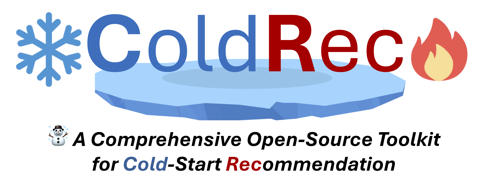

------

  <a href="#opengsl">Overview</a> •
  <a href="#installation">Installation</a> •
  <a href="https://github.com/OpenGSL/OpenGSL/tree/main/examples">Examples</a> •
  <a href="https://opengsl.readthedocs.io/en/latest/index.html">Docs</a> •
  <a href="#citation">Citation</a> 

 

# ❄️ ColdRec 🔥
**ColdRec** is a Comprehensive Benchmark for Cold-Start Recommendation. 

---

## 🧸 Support Models
| **ID** | **Paper** | **Model** | **Venue** |
|--------|---------|:----------:|:--------------:|
| 1      | [Deep Content-based Music Recommendation](https://proceedings.neurips.cc/paper/2013/file/b3ba8f1bee1238a2f37603d90b58898d-Paper.pdf)     |    DeepMusic    |   NeurIPS 2013    |
| 2      | [Social Collaborative Filtering for Cold-start Recommendations](https://dl.acm.org/doi/10.1145/2645710.2645772)     |    KNN    |   RecSys 2014    |
| 3      | [Learning Image and User Features for Recommendation in Social Networks](https://openaccess.thecvf.com/content_iccv_2015/papers/Geng_Learning_Image_and_ICCV_2015_paper.pdf) |    DUIF     |   ICCV 2015    |
| 4      | [VBPR: Visual Bayesian Personalized Ranking from Implicit Feedback](https://ojs.aaai.org/index.php/AAAI/article/view/9973)  |   VBPR   |    AAAI 2016    |
| 5     | [DropoutNet: Addressing Cold Start in Recommender Systems](https://papers.nips.cc/paper_files/paper/2017/file/dbd22ba3bd0df8f385bdac3e9f8be207-Paper.pdf)  |   DropoutNet   | NeurIPS 2017 |
| 6      | [Adversarial Training Towards Robust Multimedia Recommender System](https://arxiv.org/pdf/1809.07062)  |    AMR    |  TKDE 2019  |
| 7     | [Warm Up Cold-start Advertisements: Improving CTR Predictions via Learning to Learn ID Embeddings](https://dl.acm.org/doi/10.1145/3331184.3331268)  |    MetaEmbedding    | SIGIR 2019 |
| 8     | [How to Learn Item Representation for Cold-Start Multimedia Recommendation?](https://dl.acm.org/doi/10.1145/3394171.3413628)  |    MTPR    | MM 2020 |
| 9     | [LARA: Attribute-to-feature Adversarial Learning for New-item Recommendation](https://ir.sdu.edu.cn/~zhaochunren/papers/7LARAAttribute-to-featureadversariallearningfornew-itemrecommendation.pdf)  |    LARA    | WSDM 2020 |
| 10     | [Recommendation for New Users and New Items via Randomized Training and Mixture-of-Experts Transformation](https://zziwei.github.io/pubs/Ziwei_SIGIR_2020_Cold.pdf)  |    Heater    | SIGIR 2020 |
| 11    | [Contrastive Learning for Cold-Start Recommendation](https://arxiv.org/pdf/2107.05315)  |    CLCRec    |  MM 2021 |
| 12     | [Generative Adversarial Framework for Cold-Start Item Recommendation](https://dl.acm.org/doi/abs/10.1145/3477495.3531897)  |    GAR   | SIGIR 2022 |
| 13     | [Aligning Distillation For Cold-start Item Recommendation](https://dl.acm.org/doi/10.1145/3539618.3591732)  |    ALDI   | SIGIR 2023 |
| 14     | [Contrastive Collaborative Filtering for Cold-Start Item Recommendation](https://arxiv.org/pdf/2302.02151)  |   CCFRec   | WWW 2023 |
| 15     | [GoRec: A Generative Cold-start Recommendation Framework](https://dl.acm.org/doi/abs/10.1145/3581783.3612238)  |   GoRec   | MM 2023 |
